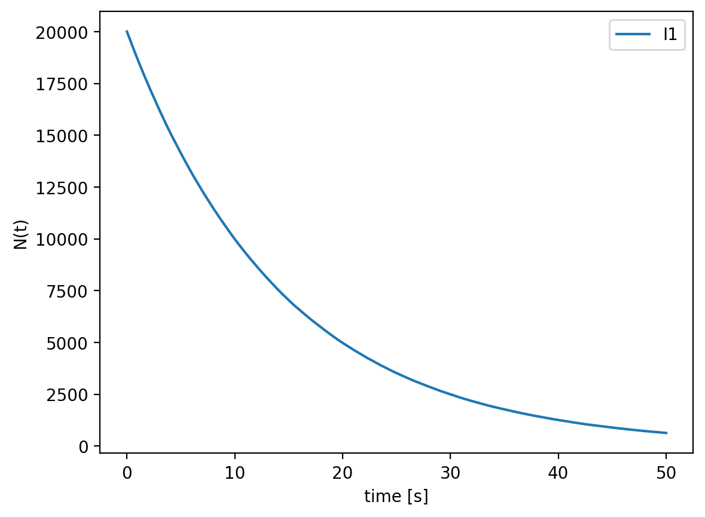
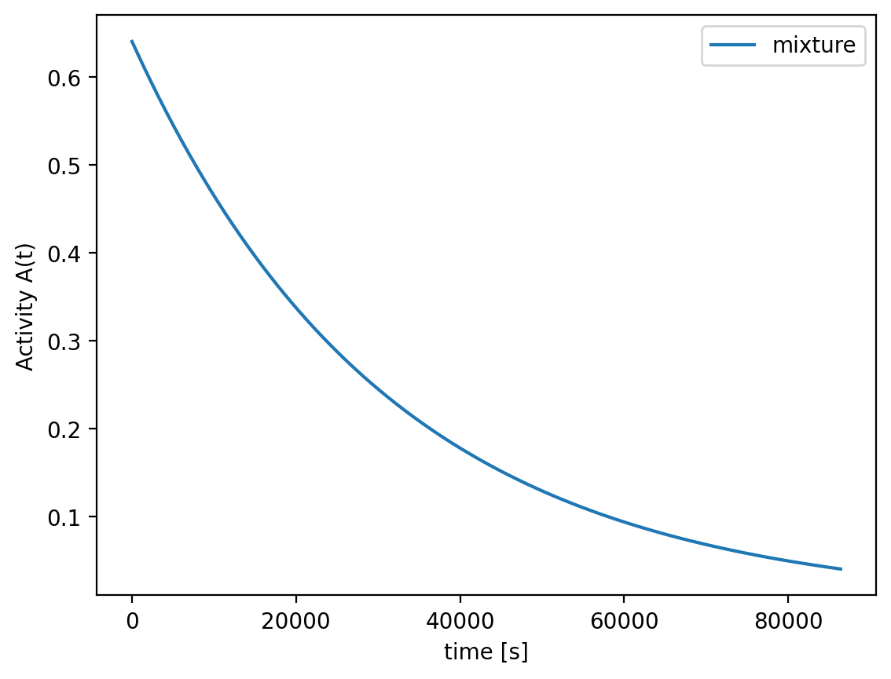

# Radioactive Decay Simulation

# Radioactive Decay Simulation

A clean, well-tested toolkit to simulate radioactive decay and reproduce the exponential law.


---

## 🔬 Physics Background
For a species with decay constant λ and half-life:

\[
T_{1/2} = \frac{\ln 2}{\lambda}
\]

The number of undecayed nuclei at time *t* is:

\[
N(t) = N_0 e^{-\lambda t}, \quad A(t)=\lambda N(t)
\]

In the Monte Carlo model, each nucleus decays in a small time step Δt with probability:

\[
p = 1 - e^{-\lambda \Delta t} \approx \lambda \Delta t
\]

---

## 🚀 Features
- **Two engines**: analytical model and Monte Carlo
- **Multi-isotope support** (mixtures, independent chains)
- **Config-driven runs** via YAML
- **Command-line interface (CLI)** for easy runs
- **Results saved** as CSV + plots (PNG)
- **Unit tests** with `pytest` for reliability

---

## ⚙️ Installation
Clone the repository and install dependencies:

```bash
git clone https://github.com/<your-username>/radioactive-decay.git
cd radioactive-decay
pip install -r requirements.txt




