[](https://doi.org/10.5281/zenodo.17063668)

[](https://github.com/Yamnasid09/Radioactive-decay/actions) [](https://doi.org/10.5281/zenodo.17063668) [](LICENSE) [](https://yamnasid09.github.io/Radioactive-decay/)


## Plots (preview)

<p align="center">
  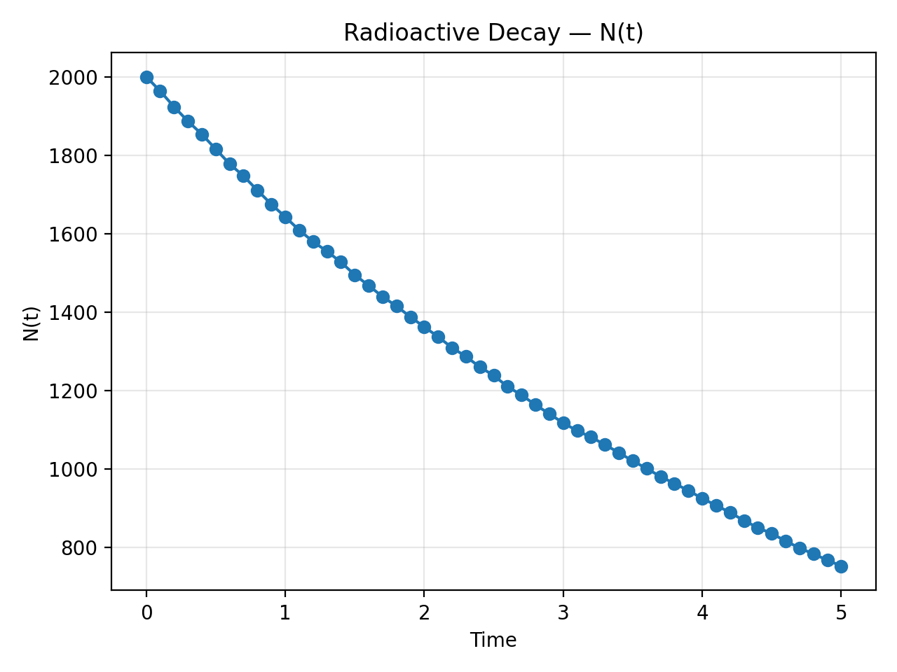 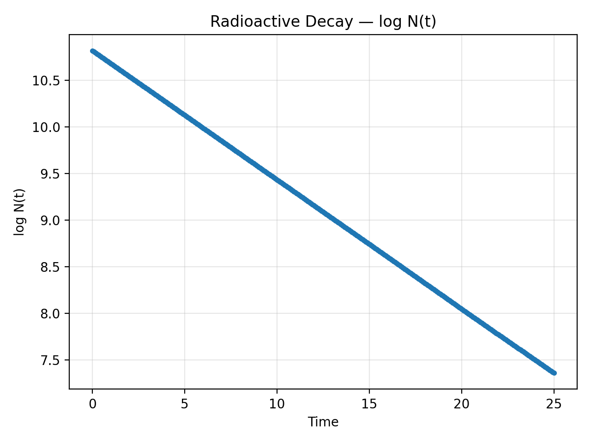
</p>
<p align="center">
  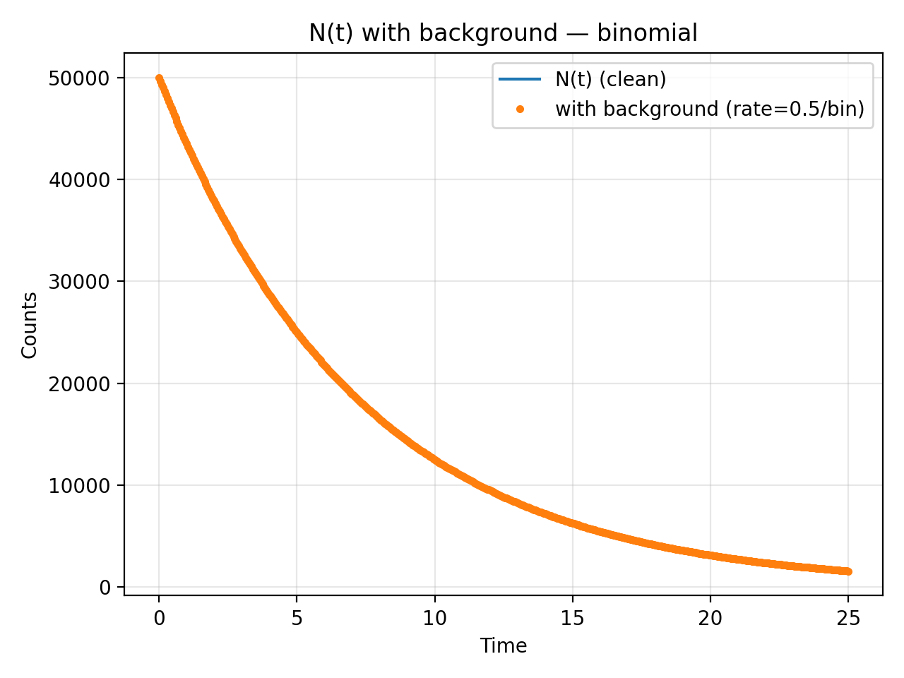 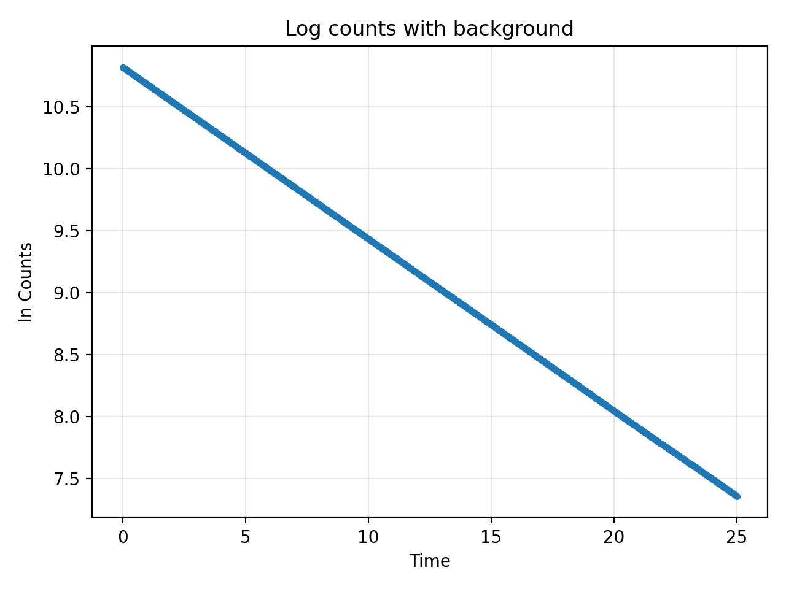
</p>


# Radioactive Decay Simulation

A clean, well-tested toolkit to simulate radioactive decay and reproduce the exponential law.

**Motivation:** I wanted a tiny simulator to verify the exponential decay law and practice basic software practices for the exam.

**Scope:** This is a small teaching project, not a full package.


## 🔬 Physics Background
For a species with decay constant λ and half-life:

\[
T_{1/2} = \frac{\ln 2}{\lambda}
\]

The number of undecayed nuclei at time *t* is:

\[
N(t) = N_0 e^{-\lambda t}, \quad A(t)=\lambda N(t)
\]

In the Monte Carlo model, each nucleus decays in a small time step Δt with probability:

\[
p = 1 - e^{-\lambda \Delta t} \approx \lambda \Delta t
\]

---
## CLI Quickstart (no YAML needed)

**Show help**
```bash
python -m src.cli -h
python -m src.cli simulate -h
python -m src.cli plot -h

## Install & Run (CLI)

Install the project as a CLI:

```bash
python -m pip install -e .

### Common isotopes (presets)

| Key   | Isotope | Half-life | Unit |
|-------|---------|-----------|------|
| tc99m | Tc-99m  | 6.01      | h    |
| i131  | I-131   | 8.02      | d    |
| cs137 | Cs-137  | 30.05     | y    |
| co60  | Co-60   | 5.27      | y    |
| f18   | F-18    | 109.77    | min  |
| c11   | C-11    | 20.334    | min  |
| n13   | N-13    | 9.965     | min  |
| o15   | O-15    | 2.037     | min  |
| i123  | I-123   | 13.22     | h    |
| tl201 | Tl-201  | 73.1      | h    |
| y90   | Y-90    | 64.1      | h    |
| lu177 | Lu-177  | 6.65      | d    |
| xe133 | Xe-133  | 5.25      | d    |
| mo99  | Mo-99   | 66.0      | h    |
| ba133 | Ba-133  | 10.52     | y    |

> Use `--isotope <key>` with `--half-life-unit` to set your time unit (keep `dt`/`tmax` in the same unit).


> Tip: choose time unit via `--half-life-unit {s|min|h|d|y}` and keep `dt`/`tmax` in the same unit.

**Examples**
```bash
# Monte-Carlo with lambda directly
python -m src.cli simulate --mode mc --lambda 0.2 --n0 2000 --tmax 5 --dt 0.1 --seed 1 --plot

# Deterministic using Tc-99m preset (hours)
python -m src.cli simulate --mode deterministic --isotope tc99m --half-life-unit h \
  --n0 20000 --tmax 24 --dt 0.1 --plot

# Monte-Carlo using I-131 (days)
python -m src.cli simulate --mode mc --isotope i131 --half-life-unit d \
  --n0 50000 --tmax 40 --dt 0.1 --seed 7 --plot
  
# Monte-Carlo using F-18 (minutes)
python -m src.cli simulate --mode mc --isotope f18 --half-life-unit min \
  --n0 100000 --tmax 240 --dt 1 --seed 42 --plot
python -m src.cli analyze --run-dir data/runs/last --out images


## Outputs

- **Data (latest run):** saved under `data/runs/<timestamp>/` and symlinked at `data/runs/last`.  
  Files: `t.npy`, `N.npy` (or `traj.npy`), `meta.json`, plus CSV copies.

- **Plots:**
  - By default, the plotting script saves to `assets/`.
  - If you used a different saver that wrote to `docs/`, you may already see figures there (e.g., `docs/*.png`).

**Regenerate plots from the latest run (into `assets/`):**
```bash
python -m src.plotting --run-dir data/runs/last --out images


```bash
python -m src.plotting --run-dir data/runs/last --out images

### Background noise (Poisson)

Add Poisson background counts per time-bin on an existing run:

```bash
python src/plot_with_bg.py --run-dir data/runs/last --bg-rate 0.5 --seed 7 --out images

## Half-life & λ estimation (CLI)

Estimate decay constant and half-life from the latest run and save a fitted log plot:

```bash
python -m src.analyze --run-dir data/runs/last --out images
## Sample Plots

<p align="center">
  
  
</p>

Optional (with background):
<p align="center">
  
  
</p>


## 🚀 Features
- **Two engines**: analytical model and Monte Carlo
- **Multi-isotope support** (mixtures, independent chains)
- **Config-driven runs** via YAML
- **Command-line interface (CLI)** for easy runs
- **Results saved** as CSV + plots (PNG)
- **Unit tests** with `pytest` for reliability
- Default engine is **binomial** (simple and fast).
- **Numba** JIT is optional and used only for small demos.

---
## Project Structure

├─ src/
│ ├─ decay.py # Core physics: deterministic, MC helpers, (optional) numba single-step
│ ├─ simulate.py # Runs a simulation based on flags/config; saves data/runs/*
│ ├─ plotting.py # Makes plots from a saved run (→ assets/ by default)
│ ├─ plot_with_bg.py # Adds Poisson background to a saved run and plots
│ └─ cli.py # CLI wrapper: presets (Tc-99m, I-131, …), half-life/λ/N0 flags
├─ config/
│ └─ default.yaml # (optional) example config; CLI can skip this
├─ data/
│ └─ runs/
│ └─ last → run_YYYYmmdd-HHMMSS/ # symlink to latest run
├─ assets/ # Exported figures (nt_curve.png, log_nt.png, bg.png)
├─ docs/ # (optional) extra figures (counts.png)
├─ README.md
├─ requirements.txt
└─ tests/ # (optional) unit tests
## ⚡ Optimization

- The default engine is binomial, which is the fastest (vectorized RNG).

Optional: a Numba JIT per-nucleus engine is available (engine: "numba"). This is mainly for teaching/benchmarking; it can be slow for large N0 or very many realizations.

**Numba demo:**
```yaml
# config/default.yaml (temporary demo)
isotopes:
  - name: Tc99m
    half_life: 21636
    N0: 5000   
monte_carlo:
  n_realizations: 20
  engine: "numba"
dt: 60
T: 3600

## ⚙️ Installation
Clone the repository and install dependencies:

```bash
git clone https://github.com/<your-username>/radioactive-decay.git
cd radioactive-decay
pip install -r requirements.txt
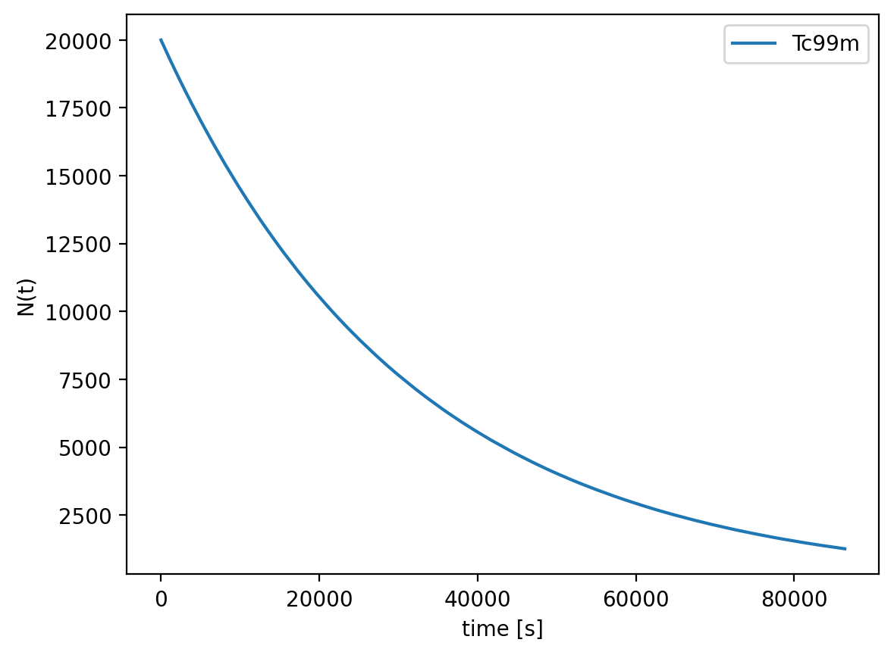
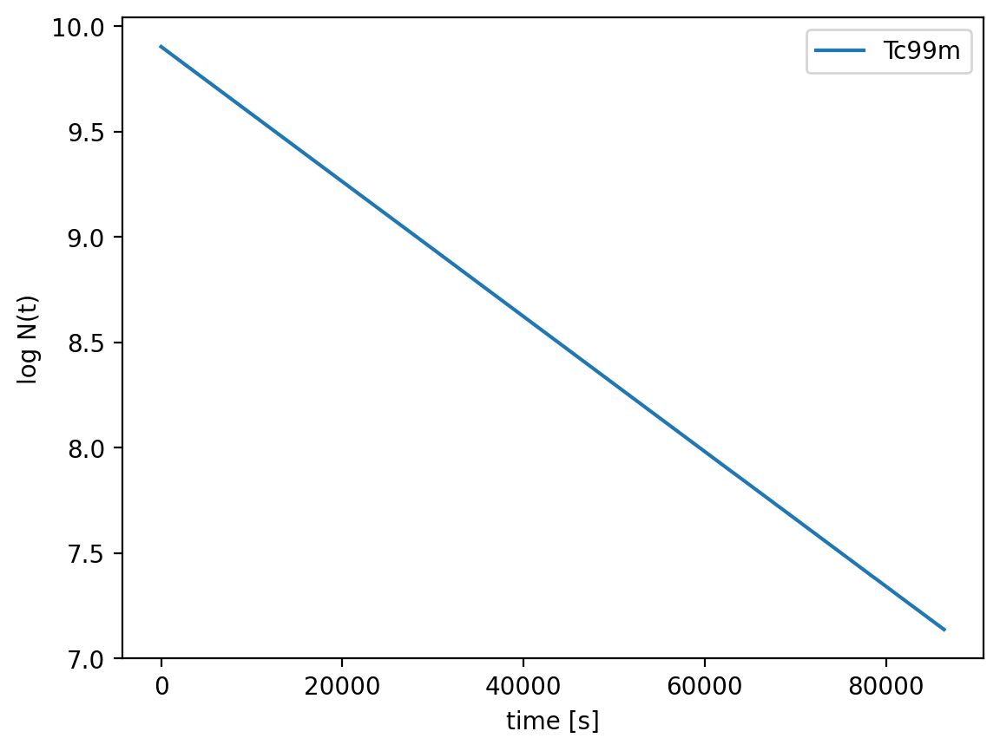

## 🔁 Reproducibility

```bash
# env install
pip install -r requirements.txt

# run simulation (Tc99m, 24h window, 300 realizations)
python -m src.cli run --config config/default.yaml

# outputs:
data/<run_id>/

# important files:
# - counts_Tc99m.png (N(t))
# - log_counts_Tc99m.png (log N vs t)
# - activity_mixture.png
# - fit_Tc99m.txt (lambda_hat, T12_hat, R2)
# - summary_fits.csv
## 🎤 Viva Checklist

- ✅ Repo overview: folder structure (`src/`, `config/`, `tests/`, `docs/`, `data/`)
- ✅ Physics recap: $N(t)=N_0 e^{-\lambda t}$, $T_{1/2}=\ln 2/\lambda$
- ✅ Install deps: `pip install -r requirements.txt`
- ✅ Tests run: `pytest -q` (explain what tests check)
- ✅ Simulation run: `python -m src.cli run --config config/default.yaml`
- ✅ Show outputs: `counts_Tc99m.png`, `log_counts_Tc99m.png`, `fit_Tc99m.txt` (T12_hat ≈ 21636 s)
- ✅ Config explain: `dt`, `T`, `n_realizations`, isotopes (Tc99m)
- ✅ Code tour: `decay.py`, `simulate.py`, `analysis.py`, `plotting.py`, `cli.py`
- ✅ Git usage: meaningful commits + tags (optional `v1.0.0`)
- ✅ CI proof: Actions “tests” badge is green
- ✅ Limitations & future work: detector noise, dead-time, decay chains, Numba/JAX


## Sample Plots (live links)
<p align="center">
  
  
</p>
<p align="center">
  
  
</p>

**Docs website:** https://yamnasid09.github.io/Radioactive-decay/

## Benchmarks

Runtime vs initial count (R=5, dt=0.05, T=5.0):

<p align="center">
  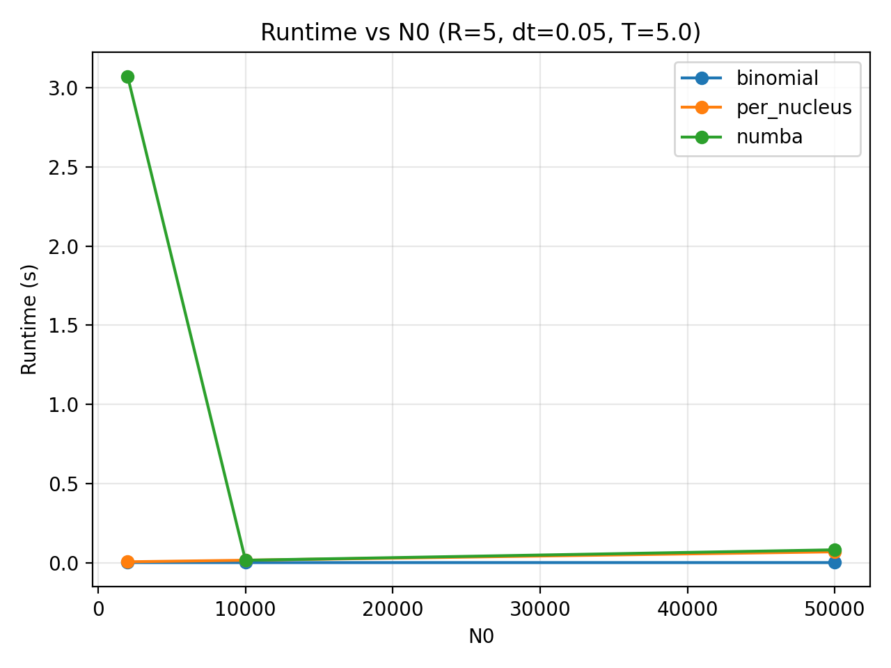
</p>

CSV: [assets/bench_runtime.csv](assets/bench_runtime.csv)

## How to cite

If you use this project, please cite:

**Siddiqui, Yamna.** *Radioactive Decay Simulation*, v0.1.1, 2025.  
DOI: 10.5281/zenodo.17063668

BibTeX:
```bibtex
@software{Siddiqui_Radioactive_Decay_Simulation_2025,
  author  = {Siddiqui, Yamna},
  title   = {Radioactive Decay Simulation},
  year    = {2025},
  version = {0.1.1},
  doi     = {10.5281/zenodo.17063668},
  url     = {https://github.com/Yamnasid09/Radioactive-decay}
}
```


## Design notes / trade-offs

- **Why `binomial` is default:** vectorized RNG over realizations & time-bins, stable for large `N0`. Complexity ~ O(R * T/dt) without per-nucleus inner loops.
- **`per_nucleus` (reference):** simplest/teaching baseline; loops over nuclei → slow for big `N0`. Useful for correctness checks.
- **`numba` per-nucleus:** JIT removes Python overhead but has compile cost; worth it for moderate `N0` with many steps. For very large `N0`, vectorized binomial is usually faster.
- **Background model:** Poisson counts per bin (`bg_rate`), added to signal; plots show clean vs background for intuition.
- **Half-life fit:** linear fit on `ln N(t)` vs `t` (ignoring nonpositive bins); saves `images/log_fit.png` and `fit.json`.
- **Reproducibility:** `numpy.random.default_rng(seed)`; outputs saved under `data/runs/<timestamp>/` with symlink `data/runs/last`.
- **Units:** keep `--half-life-unit`, `dt`, `tmax` consistent (s/min/h/d/y).

## Parameter sweep (RMSE vs theory)

F-18 (minutes): relative RMSE of Monte-Carlo mean vs theoretical curve over a grid of `N0` and `dt`.

<p align="center">
  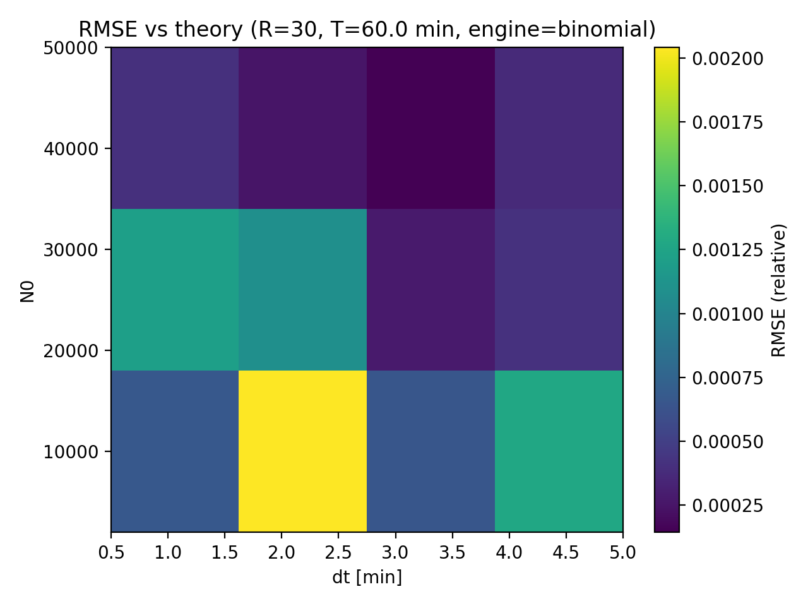
</p>

CSV: [assets/sweep_rmse_f18_min.csv](assets/sweep_rmse_f18_min.csv)

## A→B decay chain (example)

Monte-Carlo simulation of an A→B chain with \(\lambda_A=0.2\), \(\lambda_B=0.05\), \(N_{0,A}=50{,}000\) (R=50, dt=0.1).

<p align="center">
  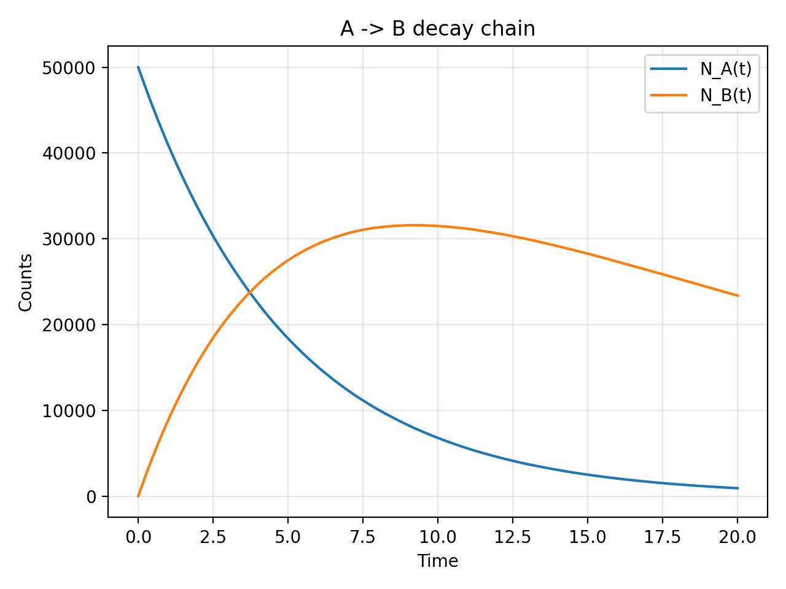
</p>

Log counts:
<p align="center">
  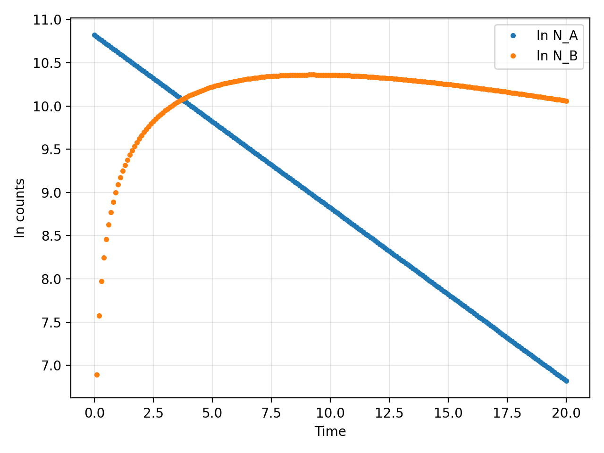
</p>

## Ensemble mean ± std (MC)

The Monte-Carlo ensemble mean with a ±1σ band, computed from `traj.npy` of the latest run.

<p align="center">
  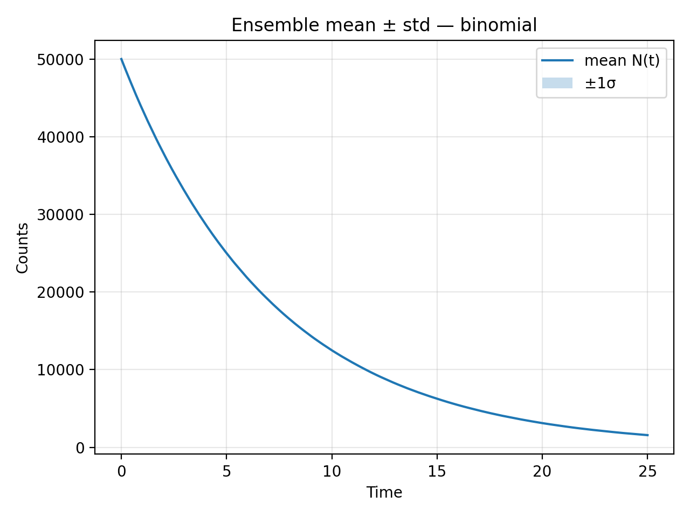
</p>
