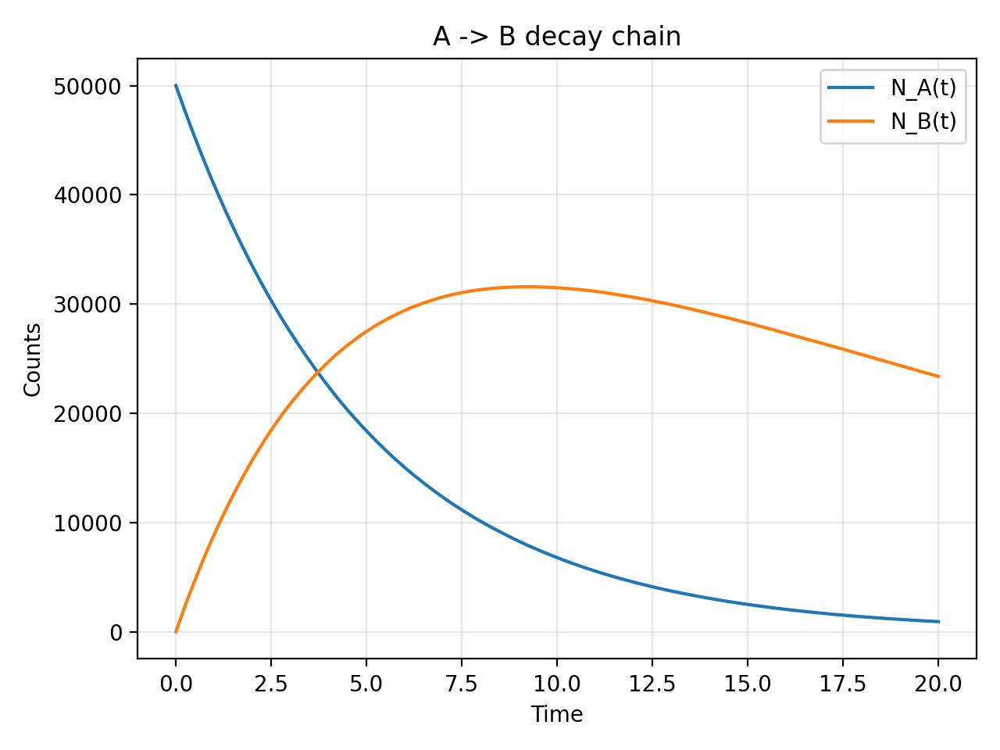
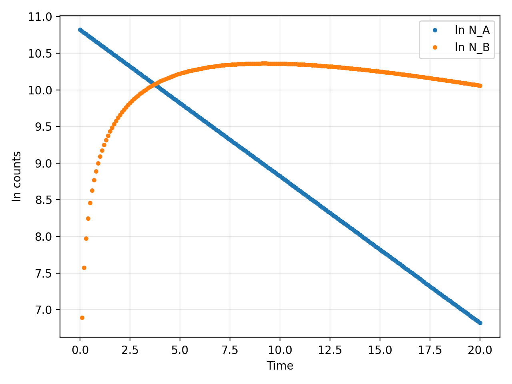

# A→B Decay Chain

Monte-Carlo example: N0_A=50,000, λ_A=0.2, λ_B=0.05 (R=50, dt=0.1).

  

Log counts:

  

Deterministic solution used for testing:
- N_A(t) = N0_A · e^{-λ_A t}
- N_B(t) = (λ_A N0_A)/(λ_B−λ_A)·(e^{-λ_A t} − e^{-λ_B t})  (equal-λ limit: λ_A N0_A t e^{-λ_A t})
