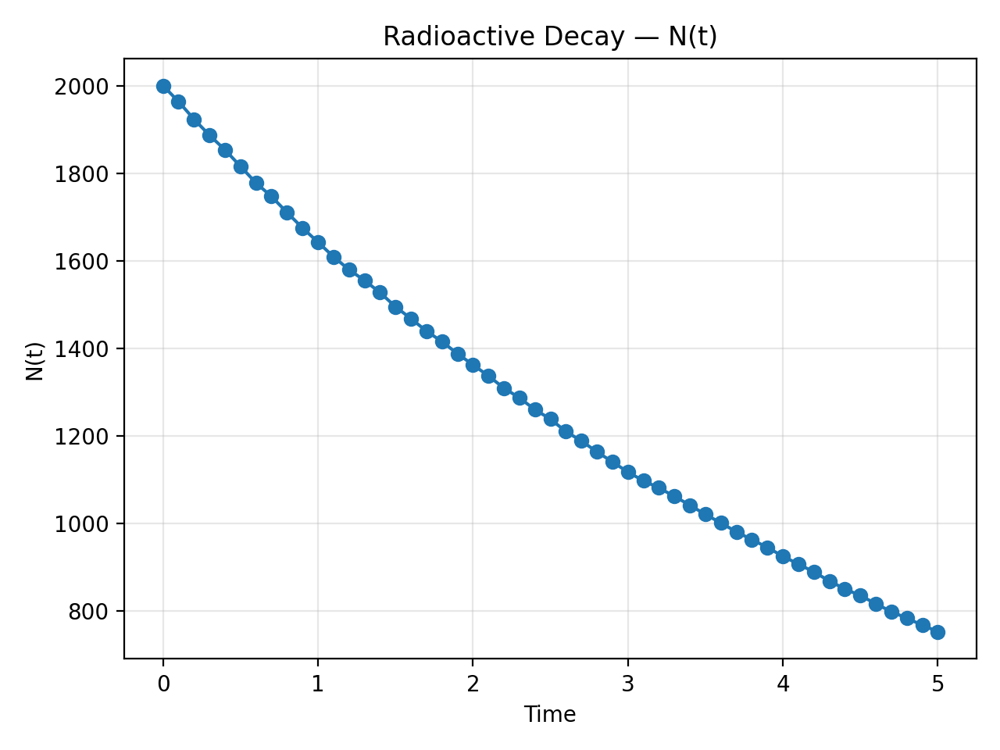
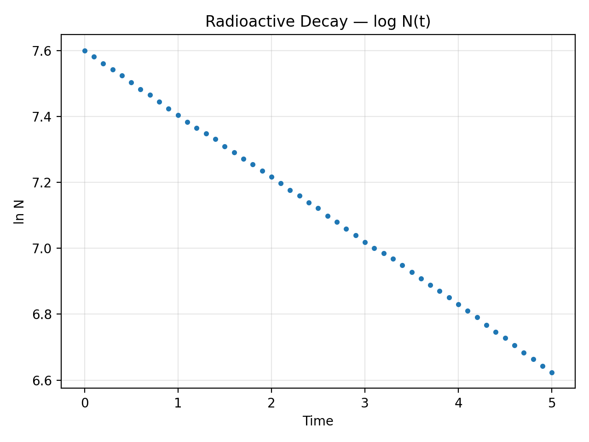
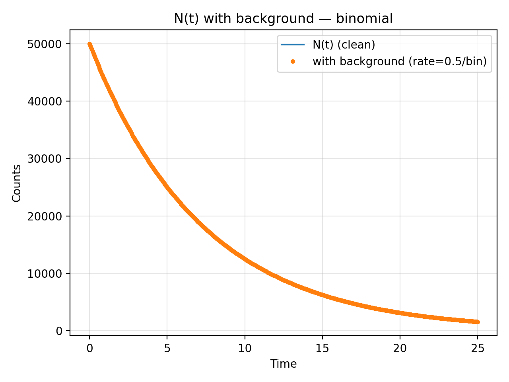
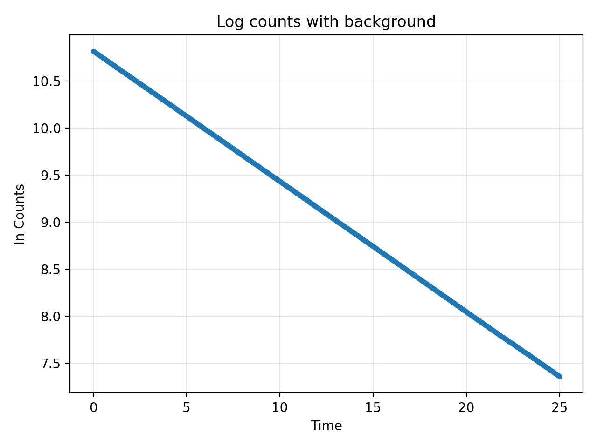

# Radioactive Decay Simulation

A tiny, teaching-grade simulator with a clean CLI to reproduce the exponential decay law,
add background counts, and estimate λ & half-life from data.

**Highlights**
- `raddecay simulate` (deterministic / MC), isotope presets + units  
- Reproducible runs saved under `data/runs/<timestamp>` with `last` symlink  
- Plots + Poisson background tool; `raddecay analyze` for λ and T½ fit  
- Tests + CI; MIT licensed

## Quickstart (CLI)

    # MC run (lambda direct) + plots
    raddecay simulate --mode mc --lambda 0.2 --n0 2000 --tmax 5 --dt 0.1 --seed 1 --plot

    # Preset isotope (F-18, minutes) + analysis
    raddecay simulate --mode mc --isotope f18 --half-life-unit min --n0 100000 --tmax 240 --dt 1 --seed 42 --plot
    raddecay analyze --run-dir data/runs/last --out images

## Sample Plots

  
  

  
  

## What’s unique here
- Vectorized binomial RNG (fast) + optional Numba demo  
- Simple run management: reproducible outputs + easy re-plot/analyze  
- Background counts & half-life fit baked-in (no notebooks required)

## Links
- See the repository README for full docs, CHANGELOG, and release notes.

## Navigation
- [Quickstart](./quickstart.md)
- [CLI Reference](./cli.md)
- [Benchmarks](./benchmarks.md)
